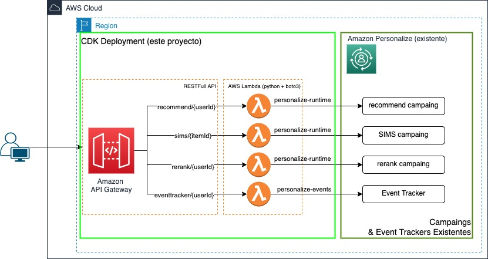

# Rest API para POC Amazon Personalize

El objetivo de este proyecto es un despliegue rápido de una API RESTfull para invocar las campañas de Amazon Personalize. Esto lo haremos con Cloud Development Kit (CDK) en Python.

Este proyecto está pensado para ser utilizado tal cual (as-is) para probar las predicciones de Amazon Personalize utilizando API Gateway y Lambda.

## Arquitectura 

Este proyecto considera una o varias campañas existentes de Amazon Personalize, a partir de ahí el proyecto genera unas API de invocación utilizando API Gateway y Lambda.



Este proyecto crea:
* Politicas de IAM y Roles para la ejecución de Lambda
* Funciones Lambda (python 3.8) para la invocación de API de Personalize con Boto3
* API / Recursos y Métodos en API Gateway para invocar las funciones Lambdas.


## 1. Despliegue 

*(Nota: Alternativamente podemos ejecutar el despliegue en una sesión de [CloudShell](https://aws.amazon.com/cloudshell/))*

### 1.1 Requisitos

Para desplegar el proyecto necesitamos cdk instalado: 

[Getting started with the AWS CDK](https://docs.aws.amazon.com/cdk/latest/guide/getting_started.html)


[Working with the AWS CDK in Python](https://docs.aws.amazon.com/cdk/latest/guide/work-with-cdk-python.html)

Nota: para validar que esté correctamente instalado cdk ejecutar en un terminal `cdk --version` y debería ver la versión:

```zsh
$ cdk --version
1.120.0 (build 6c15150)
```


### 1.2 Clonar repo

Clonamos el [repo](https://github.com/ensamblador/recomendaciones-rest-api.git) del proyecto:

```zsh
$ git clone https://github.com/ensamblador/recomendaciones-rest-api.git

Cloning into 'recomendaciones-rest-api'...
remote: Enumerating objects: 42, done.
remote: Counting objects: 100% (42/42), done.
remote: Compressing objects: 100% (28/28), done.
remote: Total 42 (delta 12), reused 39 (delta 9), pack-reused 0
Unpacking objects: 100% (42/42), done.

$ cd recomendaciones-rest-api
```

### 1.3 Creamos el ambiente virtual e instalamos dependencias

Para crear un ambiente virtual ejecutamos el comando `python3 -m venv .venv` dentro de la carpeta del proyecto. Esto nos servirá para instalar las librerías necesarias de python en ese ambiente. Luego lo activamos con `source .venv/bin/activate`, e instalamos los paquetes con el comando `pip install -r requirements.txt`:

```zsh
$ python3 -m venv .venv
$ source .venv/bin/activate
$ pip install -r requirements.txt
````

### 1.4 Editar archivo `project_config.json` 

En este archivo definimos las api que se desplegarán y los ARN de las campañas asociadas como también los event trackers disponibles:

Las secciones del archivo de configuración son:

#### Deployment config
```json 
 {
    "STACK_NAME": (nombre del stack cloudformation),
    "REGION": (region de despliegue, misma de personalize),
    ...
    "RESOURCE_TAGS": { 
        (diccionario clave / valor con etiquetas para los recursos)
        "APLICACION": "personalize-api",
        "AMBIENTE": "dev"
        ... etc
    }
 }
 ```


#### Personalize Data

```json
{
    ...
        "APIS": <definiciones de apis de recomendaciones, similar items y rerank>
        {
            "recommend": <definicion para campaña de recomendaciones>
            {
                "CAMPAIN_ARN": "arn:aws:personalize:<region>:<account>:campaign/<cmpain-name>",
                "API_NAME": "recommend" <nombre de la api para API Gateway>
            },
            "sims": 
            <definicion para campaña sims>
            {
                "CAMPAIN_ARN": "arn:aws:personalize:<region>:<account>:campaign/<cmpain-name>",
                "API_NAME": "sims" 
            },
            "rerank": 
            <definicion para campaña de rerank>
            {
                "CAMPAIN_ARN": "arn:aws:personalize:<region>:<account>:campaign/<cmpain-name>",
                "API_NAME": "rerank"
            }
        },
    "EVENT_TRACKERS": 
    <definiciones para cada event tracker, si es que hay>
    {
        "eventtracker":{
            "TRACKING_ID": <tracking ID del event tracker>,
            "API_NAME": "eventtracker", <api name para despliegue en API Gateway>
            "DEFAULT_EVENT_TYPE": "RATING", <Event type por defecto>
            "DEFAULT_EVENT_VALUE": "9" <event value por defecto>
        } 

    }
    ...
}
```

### 1.5 Despliegue

Para desplegar el proyecto debemos ejecutar `cdk deploy` no obstante previamente ejecutemos `cdk diff` para revisar las diferencias entre nuestro proyecto local y aws:

```zsh
$cdk diff 
```

Nota: todos los comandos CDK se ejecutan utilizando el Default Profile de aws cli. Si quisieramos usar un profile en particular debemos agregar `--profile <profile-name>` a los comandos.

```zsh
$cdk diff --profile <profile-name>
```

Luego para desplegar el proyecto ejecutamos (nos solicitará aprobación para crear los roles y permisos IAM)

```zsh
$ cdk deploy 
```

Una vez finalizado nos entregará los outputs con las URL de las API Rest que ha creado:

```zsh
 ✅  PERSONALIZE-API-CS

Outputs:
PERSONALIZE-API-CS.apiconstructeventtracker = https://<url>/prod/eventtracker/{userId}
PERSONALIZE-API-CS.apiconstructrecommend = https://<url>/prod/recommend/{userId}
PERSONALIZE-API-CS.apiconstructrerank = https://<url>.amazonaws.com/prod/rerank/{userId}
PERSONALIZE-API-CS.apiconstructsims = https://<url>/prod/sims/{itemId}
```

## 2 Uso de las APIs

### 2.1 SIMS (Similar Items)

Items similares nos entrega un listado de 25 elementos similares al que estamos consultando

Ejemplo, obtener items similares al item itemId = 1000

Request:
```
 [GET/POST] https://<url>/prod/sims/1000
```
Respuesta:
```json
{
    "data": {
        "ResponseMetadata": {
            "RequestId": "e643fc05-515a-41ef-babe-fbc0d8b473ab",
            "HTTPStatusCode": 200,
            "HTTPHeaders": {
                ...
            },
            "RetryAttempts": 0
        },
        "itemList": [
            {
                "itemId": "1677"
            },
            {
                "itemId": "1803"
            },
            ...
        ],
        "recommendationId": "RID-0241e16a-374f-4f90-866a-24e4e3f02f96"
    }
}
```


### 2.2 Recomendación a usuarios

Recomienda 25 items para el usuario = userId

Ejemplo recomendaciones para el usuario userId = 300

Request:
```web
Request: [GET/POST] https://<url>/prod/recommend/300
```
Respuesta:
```json
{
    "data": {
        "ResponseMetadata": {
            ...
        },
        "itemList": [
            {
                "itemId": "8074",
                "score": 0.0496781
            },
            {
                "itemId": "35120",
                "score": 0.0288684
            },
            ...
        ],
        "recommendationId": "RID-0094bb73-d867-4878-a118-ce433cd64238"
    }
}
```

### 2.3 Rerank de items para usuarios

Reordena items para un usuario según orden de recomendación

Ejemplo: ordernar los items ["3000", "3001", "2500"] para el usuario userId = 300

Request:
```web
[POST] https://<url>/prod/rerank/300
body : 
{
    "inputList": ["3000", "3001", "2500"]
}
```
Respuesta:
```json
{
    "data": {
        "ResponseMetadata": {
            ...
        },
        "personalizedRanking": [
            {
                "itemId": "2500",
                "score": 0.6063433
            },
            {
                "itemId": "3001",
                "score": 0.3536862
            },
            {
                "itemId": "3000",
                "score": 0.0399705
            }
        ],
        "recommendationId": "RID-d0649701-b620-4485-90af-adca309698a9"
    }
}
```

## 2.4 Uso de filtros en las consultas

Para usar filtros ya creados en Amazon Personalize utilizamos el metodo POST de la API y pasarmos filterArn en el body:

Recomienda 25 items para el usuario = userId pero solo que cumplan con filterArn (puede ser una categoría o condición que está definida previamente en el filtro)

Ejemplo recomendaciones para el usuario userId = 300 aplicando el filtro categoría herramientas

Request:
```web
Request: [POST] https://<url>/prod/recommend/300
body : 
{
    "filterArn": "arn:aws:personalize:<region>:<account>:filter/herramientas"
}
```
Respuesta:
```json
{
    "data": {
        "ResponseMetadata": {
            ...
        },
        "itemList": [
            {
                "itemId": "38000",
                "score": 0.1712287
            },
            {
                "itemId": "1535",
                "score": 0.1353128
            },
            {
                "itemId": "28851",
                "score": 0.0518144
            },
            ...
        ],
        "recommendationId": "RID-e869a11a-b7a1-4425-a68e-6bf9b2d667de"
    }
}
```

## 2.5 Actualización de Interacciones

Si se configuró un event tracker en `project_config.json` se generará una API para registrar en Amazon Personalize estas nuevas interacciones.

```
POST https://<url>/prod/eventtracker/{userId}
body 
{
    "itemId": (id del item con que se interactúa),
    "eventType": (tipo de evento, ej: click, compra, view),
    "eventValue": (valor del evento, de existir por ejemplo calificación),
    "sessionId": (identificador de la sesión)
}
```

Ejemplo: Usuario userId = 20000 califica con nota = 9 una serie itemId = 199. 

equest:
```web
POST https://<url>/prod/eventtracker/20000
body : 
{
    "itemId": "199",
    "eventType": "RATING",
    "eventValue": 9,
    "sessionId": "96e5a75b-8c71-42ea-a0ad-d9c474c44422"
}
```
Respuesta:
```json
{
    "data": {
        "ResponseMetadata": {
            "RequestId": "96e5a75b-8c71-42ea-a0ad-d9c474c44422",
            "HTTPStatusCode": 200,
            "HTTPHeaders": {
                ...
            },
            "RetryAttempts": 0
        }
    }
}
```

Las siguientes recomendaciones para el usuario 20000 considerarán los nuevos datos, así como las recomendaciones a otros usuarios con gustos similares.

Nota: la interaccion se almacena con el timestamp cuando se invoca la API.


## 3 Limpieza de los recursos

Para limpiar y eliminar todos los recursos creados por este proyecto ejecutamos :

```zsh
$ cdk destroy 
```

Alternativamente, ir a la consola de **cloudformation** seleccionar el stack con el nombre <STACK_NAME> y hacer click **Delete** y confirmar.

